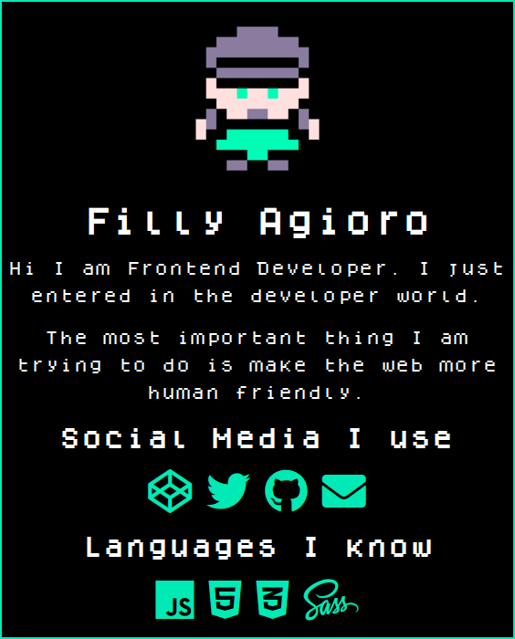

# The Simple Portfolio Website

I use this project to my personal portfolio website. Most of the website templates are made of some kind of framework. For most people they only know about simple languages like HTML, CSS or JS. You don't need know anything about framework you get started with simple knowledge of HTML, CSS or JS.

## 🏃️ Getting Started

- You just need to edit [`index.html`](index.html) file.
- For more harder customization you can edit the [`style.css`](dist/style.css).
- All the logo and image are in [`src`](src) folder.
- **Note:** If you have knowledge of `SASS` you can also edit [`style.scss`](style.scss) file.

## 🏗️ Built With

- [Font Awesome](https://fontawesome.com/) - Icon
- [Fontlibary](https://fontlibrary.org/en/font/dogica) - Fonts

## 🚸 Support

To support this project development please consider [Donating](https://kutt.it/Cryptocurrency).

## 👥 Contributing

Please read [`CONTRIBUTING.md`](https://github.com/FillyAgioro/.github/blob/main/CONTRIBUTING.md) for details on our code of conduct, and the process for submitting pull requests to us.

See also the list of [Contributors](@all) who participated in this project.

## 📄️ License

This project is licensed under the GPL-3.0 - see the [`LICENSE.md`](LICENSE.md) file for details.
